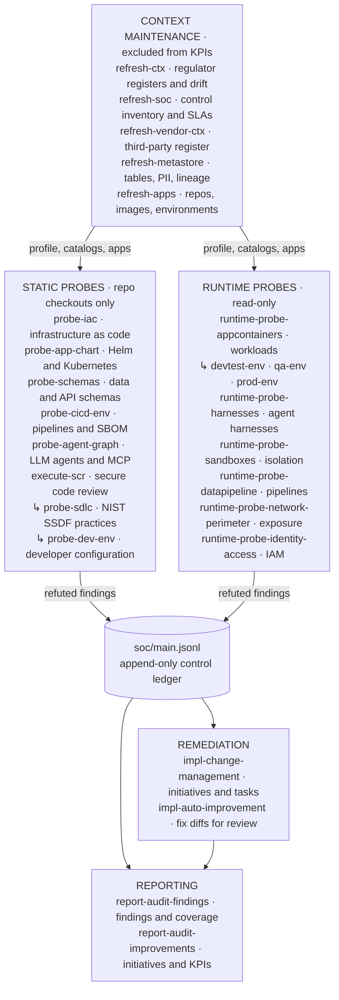

# Maxwell

**A self-hostable cybersecurity and compliance agent for regulated financial-services companies.**

Maxwell runs security and compliance workflows over a company's own applications, infrastructure and vendors. It
records everything as schema-validated JSON in a git workspace, and ties every finding to the regulation it breaks.
It is built for Indian regulated entities first: SEBI, RBI, IRDAI, CERT-In and the DPDP Rules. It maps to global
frameworks where they help. Maxwell is designed to run headlessly on [Claude Code](https://code.claude.com) and
[OpenCode](https://opencode.ai), on your own infrastructure.

> **Status: early development.** Schemas, guardrails, the seven India catalogs and all workflow definitions are in
> place. End-to-end runs against the fictional `example-co` company are in progress. Expect breaking changes.

---

## Contents

- [Why Maxwell](#why-maxwell)
- [How it works](#how-it-works)
- [Workspace layout](#workspace-layout)
- [Workflows](#workflows)
- [Use cases to try](#use-cases-to-try)
- [Regulatory coverage](#regulatory-coverage)
- [KPIs](#kpis)
- [Quick start](#quick-start)
- [Running headless](#running-headless)
- [Validation and guardrails](#validation-and-guardrails)
- [Security model and known limitations](#security-model-and-known-limitations)
- [Contributing](#contributing)
- [License](#license)

## Why Maxwell

Compliance teams at brokers, banks, NBFCs and insurers answer the same questions every audit cycle. Which controls
apply to us? Is the SBOM real? Did anyone fix last quarter's VAPT findings inside the deadline? AI agents can do
much of that legwork, but left alone they drift: they invent fields, scatter notes across the repo and produce
reports nobody can reproduce.

Maxwell constrains the agent instead of trusting it:

- **The layout is law.** Only the directories and files listed in `.claude/schemas/layout.json` may exist.
- **Every file is validated.** Each JSON, JSONL and frontmatter file has a JSON Schema (draft 2020-12). Hooks reject
  invalid writes as they happen, and the git hooks and CI reject them again.
- **The control ledger is append-only.** Controls, observations, findings, risks and incidents are never edited in
  place. Each refresh writes a versioned diff.
- **Regulator-first.** Every finding, risk and initiative cites a clause from a closed vocabulary of instruments, and
  deadlines come from an SLA table that quotes the clause.
- **Measured.** Cost of audit and change-management KPIs are computed from the harness session transcripts
  themselves.

## How it works


1. A **workflow** is a deterministic script that fans work out to specialist **agents**, has every candidate finding
   adversarially checked by a `refuter`, and only then writes through validated helpers.
2. **Agents** follow **skills**: the ledger protocol, SARIF and OCSF conversion, regulatory catalogs, rules of
   engagement for live systems, report templates and more.
3. **Hooks** in `.claude/settings.json` block writes outside the layout or containing secret-shaped strings, and
   validate every file an agent writes. The OpenCode plugin in `.agents/hooks/` runs the same scripts.
4. At session end the transcript is **ingested** for KPIs, and `npm run kpis` computes the six metrics.

## Workspace layout

```
Maxwell/
├── .agents/                              # generated OpenCode mirror of .claude/ (never edit by hand)
│   ├── agents/
│   ├── commands/
│   ├── hooks/
│   ├── schemas -> ../.claude/schemas
│   ├── scripts -> ../.claude/scripts
│   ├── skills/
│   └── workflows/
├── .claude/                              # canonical harness assets
│   ├── agents/
│   ├── commands/
│   ├── hooks/
│   ├── schemas/
│   ├── scripts/
│   ├── skills/
│   ├── workflows/
│   └── settings.json
├── .github/
│   └── workflows/
│       └── validate.yml
├── applications/
│   └── <app_id>/
│       ├── env/
│       │   └── <env_id>.json
│       ├── images/
│       │   ├── <image_id>.cdx.json       # CycloneDX SBOM
│       │   └── <image_id>.json
│       ├── repos/
│       │   ├── <repo_id>/                # gitignored checkout
│       │   └── <repo_id>.json
│       ├── README.md
│       └── credentials.json              # sops/age-encrypted references, never values
├── company-profile/
│   └── <company_id>/
│       ├── change_management/
│       │   ├── initiatives/
│       │   │   └── <init_id>/
│       │   │       ├── tasks/
│       │   │       │   └── task_<n>.json
│       │   │       └── timeline.json
│       │   └── master.json
│       ├── sdlc/
│       │   ├── metastore.json
│       │   └── policy.json
│       ├── soc/
│       │   ├── versions/
│       │   │   └── commit_<n>.diff
│       │   └── main.jsonl                # append-only state-of-controls ledger
│       ├── suggestions/
│       │   ├── suggestions/
│       │   │   └── <sug_id>/
│       │   │       └── <repo_id>/
│       │   │           └── <name>.diff
│       │   └── master.json
│       ├── vendors/
│       │   └── <vendor_id>.json
│       ├── details.json
│       └── summary.md
├── cves/
│   ├── data/
│   │   └── <vuln_id>.json
│   └── search/
│       └── <q_id>.json
├── kpis/
│   ├── data/
│   │   ├── <kpi_id>/
│   │   │   └── series.jsonl
│   │   └── raw/
│   │       ├── pagerduty/
│   │       └── sessions/
│   │           ├── claude-code/
│   │           └── opencode/
│   ├── measurement/
│   │   ├── <kpi_id>.md
│   │   └── runs.jsonl
│   └── metrics.json
├── .editorconfig
├── .gitignore
├── AGENTS.md
├── CLAUDE.md
├── LICENSE
├── README.md
├── opencode.json
├── package-lock.json
└── package.json
```

Repository checkouts under `applications/<app_id>/repos/<repo_id>/` are gitignored. Only the JSON manifests are
committed. `AGENTS.md` holds the operating rules for both harnesses, and `CLAUDE.md` imports it.

## Workflows

Maxwell ships 26 workflows. Context workflows keep the company profile and inventories current, probes turn
repositories and live environments into evidence, and the remediation and reporting workflows act on the ledger.



Invoke a workflow as `/<name> <company_id> [--app=<app_id>] [--env=<env_id>] [--dry-run]` in an interactive
session, or through the [headless runner](#running-headless). Every workflow has a `refuter` agent challenge each
candidate before anything is written. Utility commands: `/validate`, `/kpis`, `/seed-company <company_id>`,
`/status <company_id>`.

<details>
<summary>What each workflow does</summary>

**Context maintenance.** These keep the workspace current and are excluded from KPIs.

| Workflow | What it does |
|---|---|
| `refresh-ctx` | Rechecks the company profile against regulator registers, discovers new registrations and instruments, refutes drift, never deletes. |
| `refresh-soc` | Rebuilds the control inventory from the applicable catalogs, resolves findings absent twice, recomputes SLAs, versions the ledger. |
| `refresh-vendor-ctx` | Refreshes vendor assurance, subcontractors and materiality, and discovers vendors from IaC, environments and the metastore. |
| `refresh-metastore` | Catalogues tables, classified columns, pipelines and lineage per repo into `sdlc/metastore.json`. |
| `refresh-apps` | Syncs application repo checkouts, refreshes repo records, and records environment, image and credential-reference drift. |

**Static probes.** These read repository checkouts and never touch running systems.

| Workflow | What it does |
|---|---|
| `probe-iac` | Terraform, OpenTofu, CloudFormation, Pulumi, Ansible and CDK misconfigurations. |
| `probe-app-chart` | Helm charts, Kustomize overlays and Kubernetes manifests: pod security, network and supply chain. |
| `probe-schemas` | Migrations, ORM models, OpenAPI, GraphQL and event schemas: unprotected PII/SPDI and weak contracts. |
| `probe-cicd-env` | CI/CD pinning, secrets, OIDC, scan gates and SBOM presence (an empty SBOM counts as missing). |
| `probe-agent-graph` | LLM agent code: tools, MCP servers, prompts, memory and egress, mapped to the OWASP Agentic Top 10 2026. |
| `execute-scr` | Secure code review scoped by exposure and data class, which also runs `probe-sdlc` and `probe-dev-env`. |
| `probe-sdlc` | The SDLC policy compared with repository evidence, one observation per NIST SSDF practice. |
| `probe-dev-env` | Developer environment configuration against the SDLC policy. |

**Runtime probes.** These run read-only commands against live environments under the rules of engagement.

| Workflow | What it does |
|---|---|
| `runtime-probe-appcontainers` | Running workloads across tiers, with `-devtest-env`, `-qa-env` and `-prod-env` as tier-scoped variants. |
| `runtime-probe-harnesses` | Deployed agent harnesses: tool allow-lists, budgets, turn caps, model pinning, egress, audit trail. |
| `runtime-probe-sandboxes` | Sandbox isolation: UID, seccomp and LSM, runtime backend, egress, leases and production separation. |
| `runtime-probe-datapipeline` | Pipelines from the metastore: idempotency, lineage, retention, PII in staging, residency, DR. |
| `runtime-probe-network-perimeter` | Exposure against declared URLs, admin planes, WAF, TLS, DNS, NetworkPolicies and egress. |
| `runtime-probe-identity-access` | IAM: wildcards, MFA, key age, workload identity, RBAC, break-glass, leavers, PAM, access reviews. |

**Remediation and reporting.**

| Workflow | What it does |
|---|---|
| `impl-change-management` | Groups open findings by root cause into ITIL-typed initiatives with owners, SLA due dates and testable tasks. |
| `impl-auto-improvement` | Drafts minimal unified diffs for open findings, never modifying the target repo, and tracks acceptance and retention. |
| `report-audit-findings` | Rewrites the findings sections of `summary.md` after refuting every number. |
| `report-audit-improvements` | Rewrites the initiatives, suggestion-acceptance and KPI sections of `summary.md`. |

</details>

## Use cases to try

Each of these runs against the fictional `example-co` company in this repository. Start `claude` in the repository
root after the [quick start](#quick-start) and paste the command. Runtime probes need access to a live environment,
but `--dry-run` works without it.

| # | Try this | Command | Where to look |
|---:|---|---|---|
| 1 | Which controls apply to us, and when is each due for re-assessment? | `/refresh-soc example-co` | `soc/main.jsonl` control records; "Control summary" in `summary.md` |
| 2 | Has a regulator changed anything that affects our registrations? | `/refresh-ctx example-co` | Drift observations and risks in the ledger; "Regulatory posture" in `summary.md` |
| 3 | A regulation we follow was repealed. Move onto its successor. | `node .claude/scripts/soc/migrate-instrument.mjs example-co --from <repealed_id> --dry-run` | A plan of controls retired and added and findings re-mapped; drop `--dry-run` to apply. Already applied to `example-co` for `rbi-it-outsourcing-md-2023` |
| 4 | Which vendors are material, and whose assurance or contract is expiring? | `/refresh-vendor-ctx example-co` | `vendors/*.json`, vendor findings, "Vendors" in `summary.md` |
| 5 | Where does personal and financial data live? | `/refresh-metastore example-co` | `sdlc/metastore.json` and classification-gap observations |
| 6 | Do our application records still match the repositories? | `/refresh-apps example-co` | `applications/*/repos/*.json` and drift gaps in the ledger |
| 7 | Any cloud or container misconfigurations in our infrastructure code? | `/probe-iac example-co --app=mcp-gateway` | Findings, with the SARIF export under `kpis/data/raw/sessions/<session_id>/` |
| 8 | Are personal data or credentials stored without protection? | `/probe-schemas example-co --app=db-models` | Findings on unprotected PII, SPDI and credential fields |
| 9 | Is our CI/CD pinned, gated and producing a real SBOM? | `/probe-cicd-env example-co` | Findings on action pinning, secrets, scan gates and SBOM presence |
| 10 | Is our AI agent or MCP server safe to point at production data? | `/probe-agent-graph example-co --app=mcp-gateway` | Findings tagged with OWASP Agentic Top 10 2026 ids |
| 11 | Review the code the way a security auditor would. | `/execute-scr example-co --app=mcp-gateway` | OWASP ASVS 5 findings, plus NIST SSDF and developer-environment observations |
| 12 | What would a production probe check, before anything touches production? | `/runtime-probe-prod-env example-co --app=mcp-gateway --env=prod --dry-run` | `inconclusive` observations listing the planned checks and the evidence needed; nothing runs against prod |
| 13 | Turn open findings into a remediation plan with owners and deadlines. | `/impl-change-management example-co` | Initiatives, timelines and tasks under `change_management/` |
| 14 | Get proposed code fixes to review. | `/impl-auto-improvement example-co --app=mcp-gateway` | Diffs under `suggestions/suggestions/<sug_id>/`, registered in `suggestions/master.json`; the repository is never changed |
| 15 | Produce an audit-ready report and see what the audit cost. | `/kpis`, then `/report-audit-findings example-co` and `/report-audit-improvements example-co` | Findings, initiatives and KPI sections of `summary.md`; `kpis/data/<kpi_id>/series.jsonl` |

Paths are relative to `company-profile/example-co/` unless they start with `applications/`, `kpis/` or `.claude/`.
Run `/status example-co` at any point for open findings by severity, overdue initiatives and pending suggestions.
Every workflow also runs headless, for example
`node .claude/scripts/run-headless.mjs --workflow probe-iac --company example-co --app mcp-gateway`.

## Regulatory coverage

Seven India catalogs ship with control-level detail. A registry in
`.claude/skills/regulatory-catalogs/references/instruments.json` records the issuer, version, dates, applicability
and hard numeric obligations of 37 instruments.

| Instrument | Controls |
|---|---:|
| SEBI Cybersecurity and Cyber Resilience Framework (CSCRF), 2024 | 136 |
| RBI Cybersecurity and Technology Risk Directions, 2026 | 228 |
| RBI Managing Risks in Outsourcing Directions, 2025 | 185 |
| RBI Master Direction on Outsourcing of IT Services, 2023 (repealed 28 Nov 2025; historical mappings only) | 90 |
| IRDAI Information and Cyber Security Guidelines, 2023 | 103 |
| CERT-In Directions under section 70B(6), 2022 | 32 |
| Digital Personal Data Protection Rules, 2025 | 52 |

Global instruments in the registry include DORA, NYDFS Part 500, PCI DSS 4.0.1, NIST CSF 2.0 and SP 800-53, ISO/IEC
27001:2022, SOC 2, OWASP ASVS 5, the OWASP LLM and Agentic Top 10 lists, the EU AI Act and CISA BOD 26-04.

Maxwell aligns its data to open standards rather than inventing formats: OSCAL for controls and findings, SARIF
2.1.0 for static results, OCSF 1.9 for runtime findings, OSV and OpenVEX for vulnerabilities, CycloneDX 1.6 for
SBOMs, OpenLineage for pipelines, and OpenTelemetry GenAI conventions for session metrics.

> Catalog text is a faithful summary of the published instruments, and entries that could not be verified against
> the source carry a maintainer-verification note. It is not legal advice.

## KPIs

KPIs come from harness session transcripts and workspace state. `kpis/measurement/<kpi_id>.md` documents each
method, and every datapoint is schema-validated.

| KPI | How it is measured |
|---|---|
| `cost_of_audit` | Tokens priced across five buckets (input, output, 5-minute and 1-hour cache writes, cache reads), deduplicated per request, cross-checked against the harness-reported cost. |
| `cm_actionability` | Share of initiatives with an owner, due date, regulatory reference, and tasks carrying acceptance criteria, a verification method and a root cause. |
| `cm_coverage` | Applicable controls with an observation in the period, plus asset coverage. |
| `cm_time_to_implementation` | Median and p90 days from initiative creation to closure, and SLA compliance. |
| `suggestion_acceptance_rate` | Accepted over decided suggestions, with merge, revert and 30-day retention rates. |
| `incident_rate` | Incidents per 1,000 changes and per application, optionally reconciled with PagerDuty by dedup key. |

Sessions of the `refresh-*` workflows are recorded but excluded from every KPI, because keeping context current is
not audit work.

## Quick start

**Prerequisites**

- Node.js 22 or later, and git
- [Claude Code](https://code.claude.com) signed in, or an Anthropic API key; [OpenCode](https://opencode.ai) is optional
- [sops](https://github.com/getsops/sops) and [age](https://github.com/FiloSottile/age) for application credentials

**Set up**

```bash
git clone https://github.com/OnFinance/Maxwell.git
cd Maxwell
npm ci                 # installs the validators and points git at .claude/hooks/git
npm run validate       # schemas, layout, data, frontmatter, workflows and OpenCode mirror
npm test               # schema unit tests and script tests
```

**Add your company and first application**

```bash
claude
> /seed-company acme-securities "Acme Securities Private Limited"
```

Then add `applications/<app_id>/` with a README, environment files and repo manifests. Use the schema examples in
`.claude/schemas/v1/application/` and the `example-co` fixture as templates. Encrypt the credential references:

```bash
age-keygen -o ~/.config/maxwell/acme.age-key.txt      # keep the private key outside the repository
node .claude/scripts/creds/sops.mjs encrypt <app_id> /path/to/decrypted-credentials.json
```

`credentials.json` holds locators such as environment variable names, Vault paths and ARNs, never secret values.

**Connect ComplianceOS search**

Agents look up regulator circulars, directions and clauses in [ComplianceOS](https://onfinance.ai) first, and use
public web search only when ComplianceOS has nothing relevant, is unavailable, or does not cover the source (CERT-In,
MeitY and DPDP material, CVE data, vendor portals). Store a ComplianceOS login once, outside the repository:

```bash
printf '{"email":"%s","password":"%s"}' "$COS_EMAIL" "$COS_PASSWORD" \
  | node .claude/scripts/cos/search.mjs set-credentials     # writes ~/.config/maxwell/complianceos.env (0600) and verifies it
node .claude/scripts/cos/search.mjs status
node .claude/scripts/cos/search.mjs search --query "managing risks in outsourcing" --regulator RBI
```

The default host is `https://complianceos-prod.onfinance.ai`; set `MAXWELL_COS_BASE_URL` for another tenant, or
`MAXWELL_COS_EMAIL` and `MAXWELL_COS_PASSWORD` in the host environment instead of the file. In an interactive session
without a stored login, Maxwell asks for it in chat. To get a read-only ComplianceOS login for Maxwell, email
team@onfinance.in.

**Run a workflow**

```bash
claude
> /refresh-ctx acme-securities
> /status acme-securities
```

## Running headless

```bash
node .claude/scripts/run-headless.mjs --workflow probe-iac --company acme-securities
node .claude/scripts/run-headless.mjs --workflow runtime-probe-qa-env --company acme-securities --env qa --dry-run
node .claude/scripts/run-headless.mjs --workflow refresh-apps --company acme-securities --harness opencode
```

- **Model.** The default is Opus. If another model is requested and hits a usage limit, the runner retries on
  `--fallback-model` (default `opus`).
- **Completion.** `claude -p` waits for background workflows only 10 idle minutes by default. The runner raises this
  to 4 hours and reports a run as successful only when the transcript shows the workflow completed.
- **KPIs.** Every session is ingested, and the harness-reported cost is recorded for the cross-check.
- **OpenCode.** OpenCode authenticates from `ANTHROPIC_API_KEY` in the environment, and its default model is
  `anthropic/claude-opus-5`. `.claude/scripts/run-workflow.mjs` runs the same workflow scripts on OpenCode.

| Script | Purpose |
|---|---|
| `npm run validate` | Every validation stage |
| `npm run validate:<stage>` | One stage: `schemas`, `layout`, `data`, `frontmatter`, `workflows` or `mirror` |
| `npm test` | Schema unit tests and script tests |
| `npm run sync:agents` | Regenerate `.agents/` and `opencode.json` from `.claude/` |
| `npm run kpis` | Compute KPI datapoints from ingested sessions and workspace state |
| `npm run ingest:session` | Ingest one harness session manually |
| `npm run fix:fmt`, `npm run fix:lint` | Format and lint the schemas |

## Validation and guardrails

- **Schemas.** 44 JSON Schemas under `.claude/schemas/`, checked for metaschema validity, lint and formatting with
  [`@sourcemeta/jsonschema`](https://github.com/sourcemeta/jsonschema). Each has unit tests with valid and invalid
  cases.
- **Closed vocabularies.** Regulators, instruments, workflows, entity types and status lifecycles live in
  `.claude/schemas/vocab/`, so an agent cannot invent an instrument or a status.
- **Write guard.** A pre-write hook blocks paths outside the layout, edits inside repository checkouts, schema edits
  without `MAXWELL_SCHEMA_EDIT=1`, hand edits to the generated `.agents/` mirror, and secret-shaped content.
- **Post-write validation.** Every JSON, JSONL or frontmatter file an agent writes is validated immediately, and
  errors go back to the agent.
- **Ledger helpers.** `soc/append.mjs` validates and appends one record or a JSONL batch (all-or-nothing), refusing
  duplicate ids. `soc/version.mjs` writes `versions/commit_<n>.diff` and detects tampering with the append-only
  history. `soc/migrate-instrument.mjs` moves a company off a repealed instrument onto its successor.
- **Git hooks and CI.** Staged files are validated on commit, the full suite and tests run on push, and
  `.github/workflows/validate.yml` repeats both in CI.

## Security model and known limitations

- **Read-only by design.** Runtime probes use read-only credentials and read-only command families. Production
  requires explicit environment ids, allowed windows and rate limits. The rules are enforced by permission rules,
  hooks and the rules-of-engagement skill.
- **No execution sandbox yet.** Probe commands run from the machine hosting the harness. A container or in-cluster
  executor is planned.
- **Scanners are not pinned yet.** Static probes use tools such as semgrep, gitleaks, trivy and checkov when
  installed, and otherwise fall back to manual review, which is less reproducible. A pinned scanner image is planned.
- **Transcript format.** Claude Code's session transcript format is internal and can change between releases. The
  parser is defensive and records the format version.
- **Cost figures are estimates.** They use list prices, not your bill.
- **ComplianceOS login.** ComplianceOS offers only user logins, so Maxwell stores an email and password in
  `~/.config/maxwell/complianceos.env` (mode 0600) and caches the token for up to 2 hours in `~/.cache/maxwell/`.
  Claude Code deny rules (`Read(~/.config/maxwell/**)`, `Read(~/.cache/maxwell/**)`) block its file tools from
  both paths, OpenCode's shell permissions deny commands that touch them, and agents are instructed never to read
  them. Use a dedicated read-only account; request one from team@onfinance.in. Credentials typed into a chat stay
  in that harness's local transcript, so rotate them if a transcript is shared.
- **`example-co` is fictional.** Its demo age key under `.claude/skills/credentials-sops/references/` protects
  nothing real. Never reuse it.

Report security issues privately to the maintainers at OnFinance rather than in public issues.

## Contributing

1. Read `AGENTS.md`. Everything in it binds human contributors too.
2. Keep to the layout. A new file type needs a rule in `.claude/schemas/layout.json` and a schema.
3. Change schemas deliberately. Set `MAXWELL_SCHEMA_EDIT=1`, update the schema's examples and its tests under
   `.claude/schemas/tests/`, and run `npm run fix:fmt`.
4. Edit harness assets in `.claude/` only, then run `npm run sync:agents` to regenerate the OpenCode mirror.
5. Run `npm run validate && npm test` before opening a pull request.

## License

[GNU Affero General Public License v3.0](LICENSE). If you run a modified Maxwell as a network service, you must make
your source available to its users.
