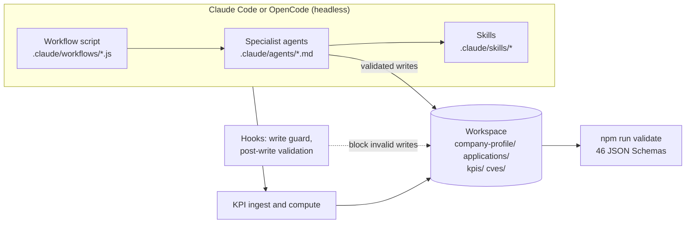
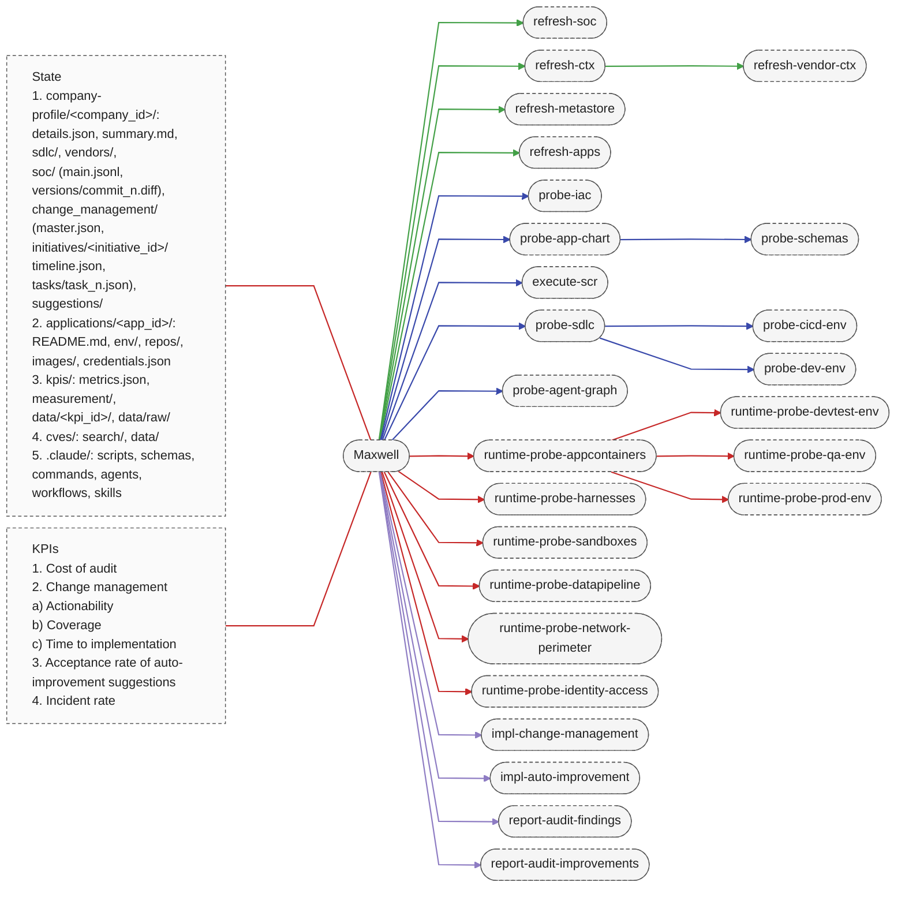

# Maxwell

**A self-hostable cybersecurity and compliance agent for regulated financial-services companies.**

Compliance teams at brokers, banks, NBFCs and insurers answer the same questions every audit cycle: which controls
apply, whether the SBOM is real, whether last quarter's findings were fixed in time. Maxwell runs those security and
compliance workflows over a company's own applications, infrastructure and vendors, built for Indian regulated
entities first (SEBI, RBI, IRDAI, CERT-In and the DPDP Rules) and mapped to global frameworks where they help. AI
agents do the legwork, but Maxwell constrains them instead of trusting them: only the layout in
`.claude/schemas/layout.json` may exist, every file is validated against a JSON Schema as it is written, the control
ledger is append-only with a versioned diff per refresh, every finding cites a regulatory clause with deadlines from
an SLA table, and audit cost is measured from the session transcripts. It runs headlessly on
[Claude Code](https://code.claude.com) and [OpenCode](https://opencode.ai), on your own infrastructure.

## Contents

- [How it works](#how-it-works)
- [Workspace layout](#workspace-layout)
- [Workflows](#workflows)
- [Use cases to try](#use-cases-to-try)
- [Regulatory coverage](#regulatory-coverage)
- [KPIs](#kpis)
- [Quick start](#quick-start)
- [Validation](#validation)
- [Guardrails](#guardrails)
- [Contributing](#contributing)
- [License](#license)

## How it works



1. A **workflow** is a deterministic script that fans work out to specialist **agents**, has every candidate finding
   adversarially checked by a `refuter`, and only then writes through validated helpers.
2. **Agents** follow **skills**: the ledger protocol, SARIF and OCSF conversion, regulatory catalogs, rules of
   engagement for live systems, report templates and more.
3. **Hooks** in `.claude/settings.json` block writes outside the layout or containing secret-shaped strings, and
   validate every file an agent writes. The OpenCode plugin in `.agents/hooks/` runs the same scripts.
4. At session end the transcript is **ingested** for KPIs, and `npm run kpis` computes the six metrics.

## Workspace layout

```
Maxwell/
├── .agents/                              # generated OpenCode mirror of .claude/ (never edit by hand)
│   ├── agents/
│   ├── commands/
│   ├── hooks/
│   ├── schemas -> ../.claude/schemas
│   ├── scripts -> ../.claude/scripts
│   ├── skills/
│   └── workflows/
├── .claude/                              # canonical harness assets
│   ├── agents/
│   ├── commands/
│   ├── hooks/
│   ├── schemas/
│   ├── scripts/
│   ├── skills/
│   ├── workflows/
│   └── settings.json
├── .github/
│   └── workflows/
│       └── validate.yml
├── applications/
│   └── <app_id>/
│       ├── env/
│       │   └── <env_id>.json
│       ├── images/
│       │   ├── <image_id>.cdx.json       # CycloneDX SBOM
│       │   └── <image_id>.json
│       ├── repos/
│       │   ├── <repo_id>/                # gitignored checkout
│       │   └── <repo_id>.json
│       ├── README.md
│       └── credentials.json              # sops/age-encrypted references, never values
├── company-profile/
│   └── <company_id>/
│       ├── change_management/
│       │   ├── initiatives/
│       │   │   └── <init_id>/
│       │   │       ├── tasks/
│       │   │       │   └── task_<n>.json
│       │   │       └── timeline.json
│       │   └── master.json
│       ├── sdlc/
│       │   ├── executor.json             # where scanners and runtime probes run
│       │   ├── metastore.json
│       │   └── policy.json
│       ├── soc/
│       │   ├── versions/
│       │   │   └── commit_<n>.diff
│       │   └── main.jsonl                # append-only state-of-controls ledger
│       ├── suggestions/
│       │   ├── suggestions/
│       │   │   └── <sug_id>/
│       │   │       └── <repo_id>/
│       │   │           └── <name>.diff
│       │   └── master.json
│       ├── vendors/
│       │   └── <vendor_id>.json
│       ├── details.json
│       └── summary.md
├── cves/
│   ├── data/
│   │   └── <vuln_id>.json
│   └── search/
│       └── <q_id>.json
├── kpis/
│   ├── data/
│   │   ├── <kpi_id>/
│   │   │   └── series.jsonl
│   │   └── raw/
│   │       ├── pagerduty/
│   │       └── sessions/
│   │           ├── claude-code/
│   │           └── opencode/
│   ├── measurement/
│   │   ├── <kpi_id>.md
│   │   └── runs.jsonl
│   └── metrics.json
├── .editorconfig
├── .gitignore
├── AGENTS.md
├── CLAUDE.md
├── LICENSE
├── README.md
├── opencode.json
├── package-lock.json
└── package.json
```

Repository checkouts under `applications/<app_id>/repos/<repo_id>/` are gitignored. Only the JSON manifests are
committed. `AGENTS.md` holds the operating rules for both harnesses, and `CLAUDE.md` imports it.

## Workflows

Maxwell ships 26 workflows. Context workflows keep the company profile and inventories current, probes turn
repositories and live environments into evidence, and the remediation and reporting workflows act on the ledger.



Invoke a workflow as `/<name> <company_id> [--app=<app_id>] [--env=<env_id>] [--dry-run]` in an interactive
session, or through the [headless runner](#quick-start). Every workflow has a `refuter` agent challenge each
candidate before anything is written. Utility commands: `/validate`, `/kpis`, `/seed-company <company_id>`,
`/status <company_id>`, `/connect-sandbox <company_id>`.

<details>
<summary>What each workflow does</summary>

**Context maintenance.** These keep the workspace current and are excluded from KPIs.

| Workflow | What it does |
|---|---|
| `refresh-ctx` | Rechecks the company profile against regulator registers, discovers new registrations and instruments, refutes drift, never deletes. |
| `refresh-soc` | Rebuilds the control inventory from the applicable catalogs, resolves findings absent twice, recomputes SLAs, versions the ledger. |
| `refresh-vendor-ctx` | Refreshes vendor assurance, subcontractors and materiality, and discovers vendors from IaC, environments and the metastore. |
| `refresh-metastore` | Catalogues tables, classified columns, pipelines and lineage per repo into `sdlc/metastore.json`. |
| `refresh-apps` | Syncs application repo checkouts, refreshes repo records, and records environment, image and credential-reference drift. |

**Static probes.** These read repository checkouts and never touch running systems.

| Workflow | What it does |
|---|---|
| `probe-iac` | Terraform, OpenTofu, CloudFormation, Pulumi, Ansible and CDK misconfigurations. |
| `probe-app-chart` | Helm charts, Kustomize overlays and Kubernetes manifests: pod security, network and supply chain. |
| `probe-schemas` | Migrations, ORM models, OpenAPI, GraphQL and event schemas: unprotected PII/SPDI and weak contracts. |
| `probe-cicd-env` | CI/CD pinning, secrets, OIDC, scan gates and SBOM presence (an empty SBOM counts as missing). |
| `probe-agent-graph` | LLM agent code: tools, MCP servers, prompts, memory and egress, mapped to the OWASP Agentic Top 10 2026. |
| `execute-scr` | Secure code review scoped by exposure and data class, which also runs `probe-sdlc` and `probe-dev-env`. |
| `probe-sdlc` | The SDLC policy compared with repository evidence, one observation per NIST SSDF practice. |
| `probe-dev-env` | Developer environment configuration against the SDLC policy. |

**Runtime probes.** These run read-only commands against live environments under the rules of engagement.

| Workflow | What it does |
|---|---|
| `runtime-probe-appcontainers` | Running workloads across tiers, with `-devtest-env`, `-qa-env` and `-prod-env` as tier-scoped variants. |
| `runtime-probe-harnesses` | Deployed agent harnesses: tool allow-lists, budgets, turn caps, model pinning, egress, audit trail. |
| `runtime-probe-sandboxes` | Sandbox isolation: UID, seccomp and LSM, runtime backend, egress, leases and production separation. |
| `runtime-probe-datapipeline` | Pipelines from the metastore: idempotency, lineage, retention, PII in staging, residency, DR. |
| `runtime-probe-network-perimeter` | Exposure against declared URLs, admin planes, WAF, TLS, DNS, NetworkPolicies and egress. |
| `runtime-probe-identity-access` | IAM: wildcards, MFA, key age, workload identity, RBAC, break-glass, leavers, PAM, access reviews. |

**Remediation and reporting.**

| Workflow | What it does |
|---|---|
| `impl-change-management` | Groups open findings by root cause into ITIL-typed initiatives with owners, SLA due dates and testable tasks. |
| `impl-auto-improvement` | Drafts minimal unified diffs for open findings, never modifying the target repo, and tracks acceptance and retention. |
| `report-audit-findings` | Rewrites the findings sections of `summary.md` after refuting every number. |
| `report-audit-improvements` | Rewrites the initiatives, suggestion-acceptance and KPI sections of `summary.md`. |

</details>

## Use cases to try

### Compliance officer

1. Which controls apply to example-co, and when is each one due?
2. Has SEBI or RBI changed anything that affects example-co's registrations?
3. RBI repealed a direction we follow. Move example-co onto its replacement.
4. Which of our vendors are critical, and whose SOC 2 report or contract is about to expire?
5. Write the audit report and tell me what this audit cost.

### Data protection officer

1. Where does example-co keep personal and financial data?
2. Are passwords or personal data stored unprotected in db-models?

### CISO or security lead

1. What's the status of example-co?
2. Check mcp-gateway's infrastructure code for cloud misconfigurations.
3. Is our MCP server safe to point at production data?
4. What would you check in production, without touching it?
5. Turn the open findings into a remediation plan with owners and deadlines.

### Engineering and DevSecOps

1. Where should scans run for example-co?
2. Pull the latest code for our applications and tell me what drifted.
3. Is our CI/CD pipeline pinned, gated and producing a real SBOM?
4. Do a security code review of mcp-gateway.
5. Suggest code fixes for the open findings.

## Regulatory coverage

Seven India catalogs ship with control-level detail. A registry in
`.claude/skills/regulatory-catalogs/references/instruments.json` records the issuer, version, dates, applicability
and hard numeric obligations of 37 instruments.

| Instrument | Controls |
|---|---:|
| SEBI Cybersecurity and Cyber Resilience Framework (CSCRF), 2024 | 136 |
| RBI Cybersecurity and Technology Risk Directions, 2026 | 228 |
| RBI Managing Risks in Outsourcing Directions, 2025 | 185 |
| RBI Master Direction on Outsourcing of IT Services, 2023 (repealed 28 Nov 2025; historical mappings only) | 90 |
| IRDAI Information and Cyber Security Guidelines, 2023 | 103 |
| CERT-In Directions under section 70B(6), 2022 | 32 |
| Digital Personal Data Protection Rules, 2025 | 52 |

Global instruments in the registry include DORA, NYDFS Part 500, PCI DSS 4.0.1, NIST CSF 2.0 and SP 800-53, ISO/IEC
27001:2022, SOC 2, OWASP ASVS 5, the OWASP LLM and Agentic Top 10 lists, the EU AI Act and CISA BOD 26-04.

Maxwell aligns its data to open standards rather than inventing formats: OSCAL for controls and findings, SARIF
2.1.0 for static results, OCSF 1.9 for runtime findings, OSV and OpenVEX for vulnerabilities, CycloneDX 1.6 for
SBOMs, OpenLineage for pipelines, and OpenTelemetry GenAI conventions for session metrics.

> Catalog text is a faithful summary of the published instruments, and entries that could not be verified against
> the source carry a maintainer-verification note. It is not legal advice.

## KPIs

The six KPIs follow the life of an audit: what it costs, how much it examined, whether its plan can be acted on, how
fast fixes land against the regulator's deadline, whether its code fixes are kept, and whether the changes it drives
cause incidents. `npm run kpis` computes them from harness session transcripts and workspace state, each method is
documented in `kpis/measurement/<kpi_id>.md`, and every datapoint is schema-validated. Sessions of the `refresh-*`
workflows are recorded but excluded, because keeping context current is not audit work.

### Cost of audit (`cost_of_audit`)

- **Why:** model spend is the running cost of an agent-run audit, so every run is priced from its own transcripts.
- **Measured:** each session's tokens at list price across input, output, 5-minute and 1-hour cache writes and cache
  reads, deduplicated per API request and scaled from sampled sessions to the whole run, plus a human review allowance
  (2.5 hours at $45). Cross-checked against the harness-reported cost, and normalised per application and per control
  observed.
- **Thresholds:** warn above $400 and alert above $800 per run.

### Coverage (`cm_coverage`)

- **Why:** findings mean little without knowing how much of the control surface was actually examined.
- **Measured:** applicable controls with an observation in the period over all applicable controls; application and
  environment pairs observed over all defined; and open high or critical findings linked to an initiative over all of
  them.
- **Thresholds:** warn below 85% and alert below 70%.

### Actionability (`cm_actionability`)

- **Why:** a remediation plan only helps if the owner can start on it without coming back with questions.
- **Measured:** share of initiatives created in the period that have an owner, a due date, a regulatory reference and
  a linked finding or control, and whose every task has an owner, acceptance criteria, a verification method and a
  root cause.
- **Thresholds:** warn below 0.6 and alert below 0.4.

### Time to implementation (`cm_time_to_implementation`)

- **Why:** regulators set remediation deadlines, so what counts is how fast fixes close against that SLA.
- **Measured:** median and p90 days from initiative creation to closure, the share closed by the due date taken from
  the clause's SLA, and the number of open initiatives past due.
- **Thresholds:** warn above 30 days and alert above 60 days.

### Suggestion acceptance rate (`suggestion_acceptance_rate`)

- **Why:** automated code fixes are only worth generating if reviewers keep them.
- **Measured:** accepted or merged suggestions over those decided or left undecided for 30 days, following the GitHub
  Copilot convention, with merge rate, revert rate and 30-day retention alongside.
- **Thresholds:** warn below 50% and alert below 30%.

### Incident rate (`incident_rate`)

- **Why:** the outcome that matters is fewer security incidents, and the changes Maxwell drives must not cause new
  ones.
- **Measured:** security incidents per application per month from the ledger (severity info excluded), incidents per
  1,000 changes, mean time to acknowledge and to resolve, and regulator-reporting timeliness, optionally reconciled
  with PagerDuty by dedup key.
- **Thresholds:** warn above 5 and alert above 10 per 1,000 changes.

## Quick start

You need Node.js 22 or later, git, and [Claude Code](https://code.claude.com) (or [OpenCode](https://opencode.ai)).

**1. Install**

```bash
git clone https://github.com/OnFinance/Maxwell.git
cd Maxwell
npm ci && npm run validate
```

**2. Start Maxwell and add your company**

```bash
claude
```

> Add my company acme-securities, legal name "Acme Securities Private Limited".

Then add each application under `applications/<app_id>/`, using `applications/mcp-gateway/` as a template. Credentials
are stored as encrypted references with [sops](https://github.com/getsops/sops) and [age](https://github.com/FiloSottile/age),
never as values.

**3. Choose where scans run**

> Where should scans run for acme-securities?

Maxwell asks a few questions and connects Kubernetes, Docker or Podman, E2B, Daytona, Modal, Vercel Sandbox, AWS
Lambda MicroVMs, or this machine, then checks the connection. API keys stay outside the repository.

**4. Connect ComplianceOS**

Maxwell asks for your ComplianceOS login in chat the first time it needs to look up a regulation. To get a read-only
account, email team@onfinance.in.

**5. Ask your first question**

> Has SEBI or RBI changed anything that affects acme-securities?

See [Use cases to try](#use-cases-to-try) for more.

**6. Run headless (optional)**

```bash
node .claude/scripts/run-headless.mjs --workflow probe-iac --company acme-securities [--app <id>] [--env <id>] [--dry-run]
```

Add `--harness opencode --model <provider/model>` to run on OpenCode. The run commits nothing itself: check the result
with `npm run validate`.

## Validation

- **Schemas:** 46 JSON Schemas with unit tests, plus closed vocabularies for regulators, instruments and statuses.
- **On every write:** each JSON, JSONL or frontmatter file is validated as the agent writes it.
- **Ledger:** append-only, written through helpers that validate each record and diff every version.
- **Git and CI:** validation on commit, the full suite and tests on push and in CI.

## Guardrails

- **Write guard:** blocks paths outside the layout, edits to repository checkouts and secret-shaped content.
- **Runtime probes:** read-only, with production windows and rate limits enforced before any command runs.
- **Scanners:** run only in the connected sandbox, at pinned versions verified by checksum.
- **Secrets:** encrypted references in the repository; logins stay in `~/.config/maxwell/`, which agents cannot read.

## Contributing

1. Read `AGENTS.md`. Everything in it binds human contributors too.
2. Keep to the layout. A new file type needs a rule in `.claude/schemas/layout.json` and a schema.
3. Change schemas deliberately. Set `MAXWELL_SCHEMA_EDIT=1`, update the schema's examples and its tests under
   `.claude/schemas/tests/`, and run `npm run fix:fmt`.
4. Edit harness assets in `.claude/` only, then run `npm run sync:agents` to regenerate the OpenCode mirror.
5. Run `npm run validate && npm test` before opening a pull request.

## License

[GNU Affero General Public License v3.0](LICENSE). If you run a modified Maxwell as a network service, you must make
your source available to its users.
